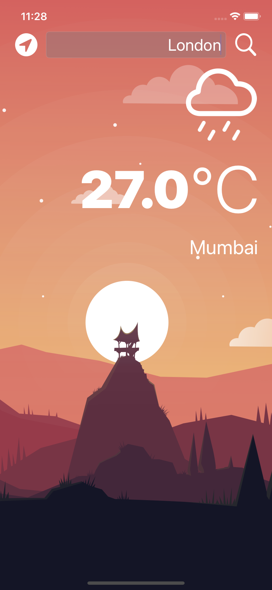

# Clima_App
A weather forecasting app with the OpenWeather API and CoreLocation.

## Output:

#### Home Screen - Display the current location weather details.

#### Search weather for different location (eg: London)

#### London - current weather condition

